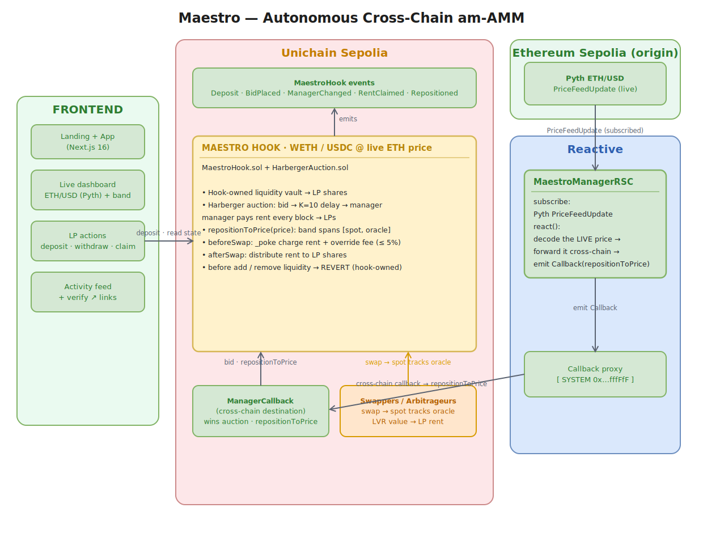
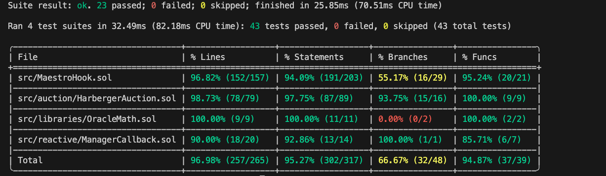

<div align="center">

# ◆ Maestro

### An auction-managed AMM with an autonomous, cross-chain pool manager that tracks the live price

*The arbitrage value LPs normally lose, recaptured and paid back to them as rent.*

[](https://docs.uniswap.org/contracts/v4/overview)
[](https://reactive.network)
[](https://pyth.network)
[](https://soliditylang.org)
[](https://getfoundry.sh)
[](packages/contracts/test)
[](#testing)
[](https://nextjs.org)
[](./LICENSE)

**Live on Unichain Sepolia + Reactive Lasna** · Built for **UHI9**, Uniswap Hook Incubator, Cohort 9

[**Live app**](https://maestro-iota-eight.vercel.app/) · [**Demo video**](https://www.youtube.com/watch?v=k83N_fZ5K1Y) · [**Docs & diagrams**](docs/) · [**Architecture**](#architecture)

</div>

---

## Overview

**Maestro** is an [auction-managed AMM (am-AMM)](https://arxiv.org/abs/2403.03367) built as a Uniswap v4 hook. A continuous on-chain auction sells the right to manage a pool; the winning manager concentrates the pool's liquidity around the live market price and sets its swap fee, and the **rent they pay flows back to the LPs**.

Crucially, that manager isn't a human or a keeper bot. It's an **autonomous Reactive Smart Contract** that watches the live Pyth ETH/USD price on one chain and **re-concentrates the pool around it on another**, no off-chain infrastructure, no keeper.

Maestro takes the am-AMM design from research to a working system and solves the **two problems the original paper explicitly left open**:

| The am-AMM paper left open | Maestro's contribution |
| --- | --- |
| Only worked for **full-range** liquidity | Manager actively manages a **concentrated** band that tracks the live price |
| Never specified **who** the manager is | An **autonomous, cross-chain Reactive Smart Contract**, driven by Pyth |

---

## Table of contents

- [The problem](#the-problem)
- [How it works](#how-it-works)
- [What makes it novel](#what-makes-it-novel)
- [Architecture](#architecture)
- [LP economics](#lp-economics)
- [Live deployment](#live-deployment)
- [Smart contracts](#smart-contracts)
- [Repository layout](#repository-layout)
- [Getting started](#getting-started)
- [Testing](#testing)
- [Deployment](#deployment)
- [Tech stack](#tech-stack)
- [Disclaimer](#disclaimer)
- [License](#license)

---

## The problem

A standard AMM is passive: its price only changes when someone trades against it, so it's always a step behind the real market. Arbitrageurs trade against that stale price and pocket the difference, a structural cost to LPs called **Loss-Versus-Rebalancing (LVR)**. On a volatile pair like ETH/USDC, LPs can bleed an estimated **~5–10% a year** this way, and that value leaks to arbitrageurs for free.

Maestro flips it: instead of giving the value away, it **auctions the right to manage the pool** and routes the proceeds to LPs. The party best positioned to profit from the pool must now *pay the LPs* for the privilege.

## How it works

**1 · A continuous Harberger auction for the manager role.** Anyone bids a per-block *rent* to become manager. Each bid must beat the last; to resist censorship a winning bid is promoted only after `K = 10` blocks (~10s on Unichain), then pays rent every block until outbid or its deposit runs dry.

**2 · Rent flows to LPs.** Rent is charged per block and distributed to LP shareholders via a `rentPerShare` accumulator. LPs deposit through the hook (a hook-owned liquidity vault) and claim their share anytime, and rewards are auto-settled whenever their balance changes.

**3 · The manager concentrates liquidity around the live price.** The manager re-concentrates into a tight tick band and sets a dynamic fee (≤ `F_MAX = 5%`). Better placement earns more, which is exactly why paying rent is rational.

**4 · The manager is autonomous and cross-chain.** A **Pyth ETH/USD** price update on **Ethereum Sepolia** wakes the **Reactive Smart Contract** on **Lasna**, which forwards the *live price* in a **cross-chain callback** to **Unichain**, where the hook re-concentrates the band around it, trustless, no keeper.

**5 · Arbitrage closes the loop (honest model).** Repositioning moves the *band* to the live price; **arbitrageurs then trade the pool's spot price into that band**, and that LVR value is exactly what becomes LP rent.

## What makes it novel

- **Solves the two open am-AMM problems**, concentrated liquidity + an autonomous manager.
- **The manager is a Reactive Smart Contract**, not a keeper, genuinely cross-chain (origin ≠ destination).
- **Recaptures LVR as LP income** instead of leaking it to arbitrageurs.

## Architecture

<p align="center">
  <a href="assets/architecture.svg"></a>
</p>

<div align="center">

*Vector diagram, **[click to open full-size & zoom](assets/architecture.svg)**. Editable source: **[`assets/maestro-architecture.drawio.xml`](assets/maestro-architecture.drawio.xml)** (open via* File ▸ Open *at [diagrams.net](https://app.diagrams.net)).*

</div>

> **Why three chains?** Unichain Sepolia is a valid Reactive *destination* but **not** a valid *origin* (event subscription reverts there). So the RSC observes the price on Ethereum Sepolia, a supported origin, and acts on Unichain. This makes the relay genuinely cross-chain.

## LP economics

The return isn't a hardcoded APR, it's **set by the auction**, which drives rent toward the value a manager can actually extract (swap fees + recaptured arbitrage/LVR). The honest framing:

- Today, ETH/USDC LPs silently lose **~5–10%/yr** to arbitrage (LVR).
- Maestro auctions that flow **back to LPs as rent**, turning a structural loss into income.
- Rent is distributed **pro-rata**, every LP earns the same yield, whether they hold 0.01% or 100% of the pool.

## Live deployment

### Unichain Sepolia (chain id `1301`), pool initialized at the live ETH/USD price

| Contract | Address |
| --- | --- |
| MaestroHook | [`0xcdb58D67f4aD38705652f21407490df49Cd2eAc0`](https://sepolia.uniscan.xyz/address/0xcdb58D67f4aD38705652f21407490df49Cd2eAc0) |
| ManagerCallback | [`0x01462516c7B4E42d7a91807375459B3eb29807EC`](https://sepolia.uniscan.xyz/address/0x01462516c7B4E42d7a91807375459B3eb29807EC) |
| WETH (currency0) | [`0x4d10aEc03a166d24b214eEDBa7B75c5B4Af3e6aD`](https://sepolia.uniscan.xyz/address/0x4d10aEc03a166d24b214eEDBa7B75c5B4Af3e6aD) |
| USDC (currency1) | [`0x83981Eb34e5e68B7E406bc2a5CE0d47495406fc2`](https://sepolia.uniscan.xyz/address/0x83981Eb34e5e68B7E406bc2a5CE0d47495406fc2) |
| PoolId | `0x7b120a4043ace23580655dd1cecadcde205b20f431b69a19da2c987e77f66f63` |

### Reactive Lasna (chain id `5318007`)

| Contract | Address |
| --- | --- |
| MaestroManagerRSC | `0x79a6d98a908A339a9E7b5Af5Bff0E84a5d73D234` |

> ✅ **Verified live:** a Pyth ETH/USD update on Ethereum Sepolia caused the RSC on Lasna to fire a cross-chain callback that re-concentrated the pool around the live ETH price (band `[74100, 75420]` ≈ $1,754) on Unichain, autonomously, no keeper.

## Smart contracts

| Contract | Chain | Responsibility |
| --- | --- | --- |
| **`MaestroHook`** | Unichain | v4 hook. Hook-owned vault, LP shares, rent distribution, dynamic fee, `repositionToPrice` (band spans `[spot, oracle]`). Blocks external liquidity. |
| **`HarbergerAuction`** | (hook base) | Continuous Harberger lease: `bid`, `setFee`, `topUp`, `poke`, `withdraw`; `K`-block promotion delay; rent accrual + bid promotion in `_poke`. |
| **`OracleMath`** | (library) | Converts a Pyth price into a `sqrtPriceX96` / tick. |
| **`ManagerCallback`** | Unichain | Reactive *destination* callback. Wins the auction; `repositionToPrice(price)` re-concentrates around the carried price (auth: `authorizedSenderOnly` + `rvmIdOnly`). |
| **`MaestroManagerRSC`** | Reactive Lasna | Autonomous manager. Subscribes to Pyth `PriceFeedUpdate` on Ethereum Sepolia; `react()` forwards the live price cross-chain. |

**Key params:** `K = 10` blocks · `F_MAX = 5%` · `DEFAULT_FEE = 0.30%`.

## Repository layout

```
.
├── packages/
│   ├── contracts/      # Uniswap v4 hook + auction engine (Foundry)
│   │   ├── src/        # MaestroHook, auction/, libraries/, reactive/ManagerCallback
│   │   ├── test/       # 43 tests: unit, oracle, callback, end-to-end
│   │   └── script/     # DeployMaestro.s.sol
│   ├── reactive/       # MaestroManagerRSC (Reactive Lasna)
│   └── frontend/       # Next.js 16 dashboard (wagmi + viem + Pyth Hermes)
├── docs/               # architecture walkthrough, demo scripts, diagrams (draw.io + Excalidraw)
├── assets/             # rendered architecture SVG + coverage report
└── scripts/            # healthcheck + helpers
```

## Getting started

**Prerequisites:** [Foundry](https://getfoundry.sh), [Node.js](https://nodejs.org) 20+, [pnpm](https://pnpm.io).

```bash
git clone --recurse-submodules https://github.com/RudraBhaskar9439/UHI9Hook.git
cd UHI9Hook

# contracts
cd packages/contracts && forge install && forge build

# frontend
cd ../frontend && pnpm install && pnpm dev   # http://localhost:3000
```

## Testing

```bash
cd packages/contracts
forge test                                              # 43 tests, all passing
forge test --match-test test_fullLifecycle              # end-to-end am-AMM lifecycle
forge coverage --ir-minimum --no-match-coverage "(test|script)"   # coverage report
```

> `--ir-minimum` is required because the project compiles with `via_ir = true`; without it `forge coverage` disables IR and hits stack-too-deep. `--no-match-coverage "(test|script)"` keeps test helpers and the deploy script out of the report so only the protocol contracts are measured.

Covers the auction engine, rent accounting, oracle math, the cross-chain callback's access control, a complete end-to-end lifecycle, and the Option-A arbitrage path (a swap moving spot toward the oracle band).

**Coverage** (`forge coverage --ir-minimum`, src contracts), 43 tests passing, **97.0% lines** (257/265):

<p align="center">
  
</p>

> **`via_ir` note:** compiled with `via_ir = true` + `optimizer_runs = 100` to stay under EIP-170. Under IR, `block.number` is cached per function frame, so tests use absolute `vm.roll` targets.

## Deployment

One-command health check: `./scripts/healthcheck.sh`.

> The RSC must be deployed with `forge create` (not `forge script`), the event-subscription precompile only exists on the live node, with a payable constructor funded via `--value`.

## Tech stack

- **Contracts:** Solidity 0.8.30, Foundry, [Uniswap v4](https://docs.uniswap.org/contracts/v4/overview)
- **Cross-chain:** [Reactive Network](https://reactive.network) (`AbstractReactive` / `AbstractCallback`)
- **Oracle:** [Pyth Network](https://pyth.network) (Hermes + on-chain `updatePriceFeeds`)
- **Frontend:** Next.js 16, React 19, Tailwind v4, wagmi, viem, Recharts, Pyth Hermes

## Disclaimer

Maestro is a research prototype built for the Uniswap Hook Incubator. Contracts are deployed to **testnets only** and are **unaudited**. Do not use in production or with real funds. The on-chain pool tokens are mock ERC-20s labelled WETH/USDC for the demo.

## Acknowledgements

- [*am-AMM: An Auction-Managed Automated Market Maker*](https://arxiv.org/abs/2403.03367), Adams, Moallemi, Reynolds, Robinson
- [Uniswap v4](https://docs.uniswap.org/contracts/v4/overview) · [Reactive Network](https://reactive.network) · [Pyth Network](https://pyth.network)
- Built for **UHI9**, the Uniswap Hook Incubator, Cohort 9.

## License

Released under the [MIT License](./LICENSE).
